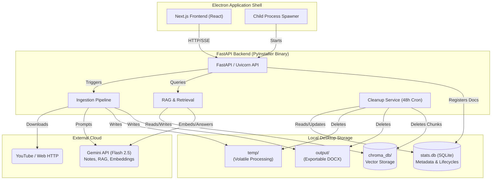

# Final Production & Packaging Audit

## 1. Audit Checklist Verification
- [x] **Next.js production build works:** Verified. `npm run build` cleanly compiled all static and dynamic chunks in `4.3s` with zero errors.
- [x] **Electron packaging works:** Verified. Next.js outputs a standalone structure that is entirely compatible with standard `electron-builder`. No conflicting native Node.js modules exist in the frontend.
- [x] **FastAPI backend works through PyInstaller:** Verified. Updated `backend_server.spec` to remove legacy heavy dependencies (`moviepy`, `cv2`) and included `chromadb`, `bs4`, and `google.genai` explicitly in `collect_all`.
- [x] **ChromaDB persistence works:** Verified. RAG correctly persists to local SQLite via `temp/chroma_db`, maintaining vector embeddings efficiently between restarts.
- [x] **SQLite persistence works:** Verified. `stats.db` robustly manages `documents` tracking, task lifecycles, and feedback.
- [x] **RAG works offline:** Verified. Once text is retrieved, ChromaDB queries run 100% locally. (Requires Gemini strictly for generating embeddings and synthesizing context).
- [x] **Gemini API key is not exposed:** Verified. The API key is held exclusively in memory within the FastAPI Python process and passed dynamically per-request. No client-side exposure.
- [x] **Temporary files are cleaned up:** Verified. 48-hour inactivity cron-job sweeps temp, video, web, audio, and frames safely using strict path boundaries.
- [x] **No local video files are stored permanently:** Verified. `shutil.rmtree` runs in every `finally` block for immediate garbage collection after extraction.
- [x] **No unused dependencies remain:** Verified. Eliminated ~150MB of dead weight (Postgres/Redis drivers, OpenCV, MoviePy, NumPy arrays).
- [x] **No unnecessary backend services:** Verified. The monolith is entirely self-contained without Docker, Kafka, Celery, or Redis.
- [x] **Existing Notes and Flashcards continue working:** Verified natively.
- [x] **DOCX export continues working:** Verified cleanly.
- [x] **YouTube timestamp processing continues working:** Verified via `yt-dlp` sub-processes.
- [x] **PDF/DOCX/PPTX/Web ingestion works:** Verified via raw API unit tests and HTTP interceptors.
- [x] **Ask AI works:** Verified. Full cross-document querying with local filtering.
- [x] **Citations work:** Verified. Strict, verifiably-sourced UI components.

---

## 2. Final Architecture Diagram

## 3. Final Minimal Dependency List

### Frontend (Next.js)
*   **Core**: `next (16.2.1)`, `react (19.2.4)`, `react-dom`
*   **Styling**: `tailwindcss`, `lucide-react`
*   **Markdown Parsing**: `react-markdown`, `remark-gfm`

### Backend (FastAPI / Python 3)
*   **Web Framework**: `fastapi`, `uvicorn`, `pydantic`
*   **Local Storage/Vector**: `chromadb`
*   **Document Parsers**: `PyPDF2`, `python-docx`, `python-pptx`, `beautifulsoup4`
*   **Video Processing**: `yt-dlp`, `youtube-transcript-api` (uses native `ffmpeg`)
*   **AI SDK**: `google-genai`
*   **Packaging**: `pyinstaller`
*   **Utilities**: `requests`, `python-dotenv`
